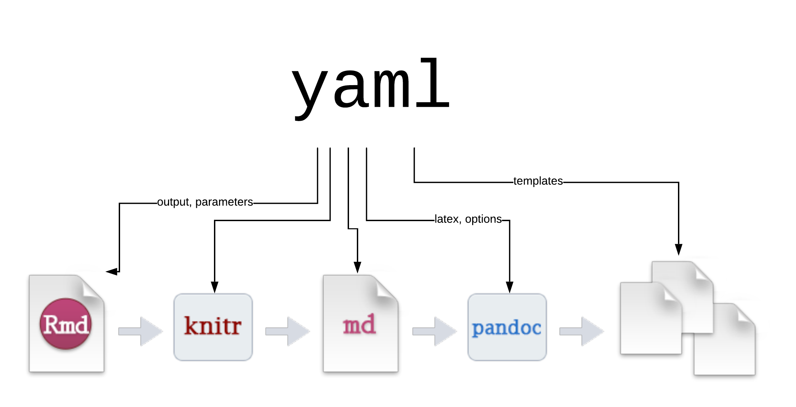
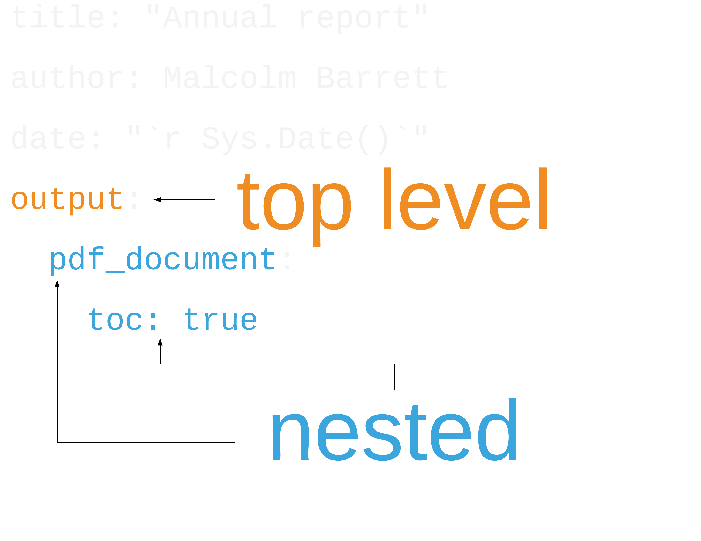

class: inverse

```{r setup, include=FALSE}
options(htmltools.dir.version = FALSE, tibble.max_extra_cols = 6, tibble.width = 60)
knitr::opts_chunk$set(warning = FALSE, message = FALSE, fig.align = "center", dpi = 320, fig.height = 4, highlight = FALSE, comment = "")
check <- function() "<span style='color:green'>\u2713</span>"
cross <- function() "<span style='color:red'>\u2717</span>"
```

```{r, echo=FALSE, out.width="100%", out.height="100%"}

```

---

```{r, echo=FALSE, out.width="100%", out.height="100%"}
knitr::include_graphics("rmarkdown_wizards.png")
```

.pull-right[Artwork by @allison_horst]

---
class: middle

```{r, echo=FALSE, out.width="100%", out.height="100%"}
knitr::include_graphics("rmarkdownflow.png")
```

---

```{r, echo=FALSE, out.width="100%", out.height="100%"}

```

---

## *Even the creator of R Markdown and knitr isn't crazy about YAML*

```{r, echo=FALSE, out.width="75%", out.height="75%"}

```

---
class: inverse, middle, center

# *YAML:*

# **Yet Another Markup Language**

# **YAML Ain't Markup Language**

---


```{r, echo=FALSE, out.width="100%", out.height="100%"}

```

---

```{r, echo=FALSE, out.width="100%", out.height="100%"}

```

---

```{r, echo=FALSE, out.width="100%", out.height="100%"}

```

---

```{r, comment = "", eval=FALSE}
library(ymlthis)
as_yml(
"title: Annual Report
author: Malcolm Barrett
date: '`r Sys.Date()`'
output:
  pdf_document:
    toc: true
"
) %>% draw_yml_tree()
```

---

```{r, comment = "", eval=FALSE}
library(ymlthis)
as_yml(
"title: Annual Report
author: Malcolm Barrett
date: '`r Sys.Date()`'
output:
  pdf_document:
    toc: true
"
) %>% draw_yml_tree() #<<
```

---

```{r, highlight.output = 4:6}
library(ymlthis)
as_yml(
"title: Annual Report
author: Malcolm Barrett
date: '`r Sys.Date()`'
output:
  pdf_document:
    toc: true
"
) %>% draw_yml_tree()
```


---

class: center

## `r emojifont::emoji("warning")` **YAML fails silently**

```{r, echo=FALSE, out.width="75%", out.height="75%"}
knitr::include_graphics("https://media.giphy.com/media/2gcmmuaqnfMt2/giphy.gif")
```

---

# Introducing ymlthis 

---

# Introducing ymlthis 

## `r emojifont::emoji("heavy_check_mark")` **Write YAML**
---

# Introducing ymlthis 

## ~~`r emojifont::emoji("heavy_check_mark")` Write YAML~~
## `r emojifont::emoji("heavy_check_mark")` **Document YAML**

---

# Introducing ymlthis 

## ~~`r emojifont::emoji("heavy_check_mark")` Write YAML~~
## ~~`r emojifont::emoji("heavy_check_mark")` Document YAML~~
## `r emojifont::emoji("heavy_check_mark")` **Improve R Markdown Workflows**

---

# Introducing ymlthis 

## ~~`r emojifont::emoji("heavy_check_mark")` Write YAML~~
## ~~`r emojifont::emoji("heavy_check_mark")` Document YAML~~
## ~~`r emojifont::emoji("heavy_check_mark")` Improve R Markdown Workflows~~
## `r emojifont::emoji("inbox_tray")` **Validation**

---

# Writing YAML

```{r, eval = FALSE}
yml()
```

---

# Writing YAML

```{r}
yml()
```

---

# Writing YAML

```{r, eval=FALSE}
yml() %>% 
  yml_output( #<<
    pdf_document(toc = TRUE), #<<
    html_document()
  )
```
---

# Writing YAML

```{r, highlight.output = 4:6}
yml() %>% 
  yml_output( #<<
    pdf_document(toc = TRUE), #<<
    html_document()
  )
```


---

# Writing YAML

```{r, eval = FALSE}
yml() %>%
  yml_author( #<<
    c("Yihui Xie", "Hadley Wickham"), #<<
    affiliation = "RStudio" #<<
  ) %>%
  yml_date("07/04/2019") %>%
  yml_title("Reproducible Research in R") %>% 
  yml_category(c("r", "reprodicibility")) %>%  #<<
  yml_output(
    pdf_document(
      keep_tex = TRUE,
      includes = includes2(after_body = "footer.tex")
    )
  ) %>%
  yml_latex_opts(biblio_style = "apalike") #<<
```

---

# Writing YAML

```{r, echo = FALSE, highlight.output=c(3:6, 9:11, 17)}
yml() %>%
  yml_author(
    c("Yihui Xie", "Hadley Wickham"),
    affiliation = "RStudio"
  ) %>%
  yml_date("07/04/2019") %>%
  yml_title("Reproducible Research in R") %>% 
  yml_category(c("r", "reprodicibility")) %>% 
  yml_output(
    pdf_document(
      keep_tex = TRUE,
      includes = includes2(after_body = "footer.tex")
    )
  ) %>%
  yml_latex_opts(biblio_style = "apalike")
```

---

class: center, middle

# R Markdown Extensions

.large[
|  package|  output function | top-level YAML |
|--:|--:|--:|
| bookdown |  `r check()` |  `r check()` |
| blogdown |  `r check()` |  `r check()` |
| pkgdown |  `r check()` |  `r check()` |
| pagedown |  `r check()` | `r check()` |
| rticles |  `r check()` |  `r check()` |
| distill |  `r check()` |  `r check()` |
| learnr |  `r check()` |  `r cross()`|
| xaringan |  `r check()` |  `r cross()`|
| revealjs |  `r check()` |  `r cross()`|
| flexdashboard |  `r check()` |  `r cross()`|
]

---

# Documenting YAML

## ?`yml_*()`

---

# Documenting YAML

```{r, echo=FALSE, out.width="100%", out.height="100%"}

```

---

# Improving R Markdown Workflows

```{r, echo=FALSE, out.width="50%", out.height="50%"}

```

---

# Improving R Markdown Workflows
## `use_yml()`


```{r}
yml() %>%
  use_yml()
# Places YAML on your cliboard
```


---

# Improving R Markdown Workflows
## `use_rmarkdown()`

```{r, eval=FALSE}
yml() %>%
  use_rmarkdown()
# opens a new R Markdown file
```

---

# Improving R Markdown Workflows

```{r,eval=FALSE}
render_rmd <- function(output) {
  yml() %>% 
    yml_date(lubridate::today() + 1) %>% 
    yml_title(glue::glue("Report with output type {output}")) %>% 
    yml_toplevel(
      output = output
    ) %>% 
    use_rmarkdown(path = glue::glue("rmd_{output}.Rmd")) %>% 
    rmarkdown::render()
}

purrr::walk(
  c("html_document", "pdf_document", "word_document"), 
  render_rmd
)
```


---

### Write to `.Rmd` files

|  function | action |
|--:|--:|
|  `use_rmarkdown()` | Write `yml` to a `.Rmd` file  |
|  `use_index_rmd()` | Write `yml` to `Index.Rmd`  |


### Write to `.yml` files

|  function | action |
|--:|--:|
|  `use_yml_file()` |  Write `yml` to a file |
|  `use_bookdown_yml()`|  Write `yml` to `_bookdown.yml` |
|  `use_navbar_yml()` | Write `yml` to `_navbar.yml` |
|  `use_output_yml()` | Write `yml` to `_output.yml` |
|  `use_pkgdown_yml()` | Write `yml` to `_pkgdown.yml`  |
|  `use_site_yml()` | Write `yml` to `_site.yml` |

---

class: inverse, center, middle

# visit the site for tutorials and documentation
# [**https://r-lib.github.io/ymlthis**](https://r-lib.github.io/ymlthis)

---

class: inverse, center, middle


### `r icon::fa("github")` [malcolmbarrett](https://github.com/malcolmbarrett/)
### `r icon::fa("twitter")` [@malco_barrett](https://twitter.com/malco_barrett)

Slides created via the R package [xaringan](https://github.com/yihui/xaringan).
